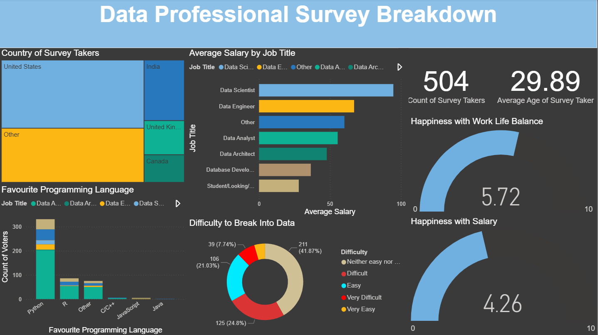

# Data Professional PowerBi
A Power BI dashboard analyzing survey responses from data professionals. It highlights trends in job roles, tools, salaries, and career satisfaction across different countries.

# Key Insights:
- Country distribution of survey participants 
- Average salary by job title
- Total number of survey takers
- Average age of respondents
- Happiness levels with work-life balance and salary
- Perceived difficulty of entering the data field
- Favorite programming languages

This project was built for learning and showcasing Power BI data visualization skills.

